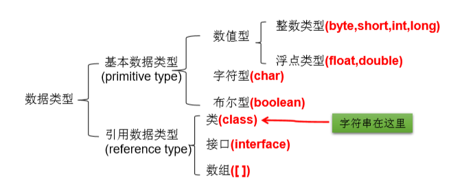
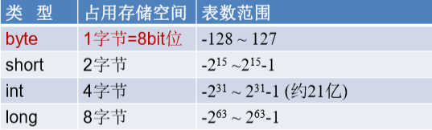
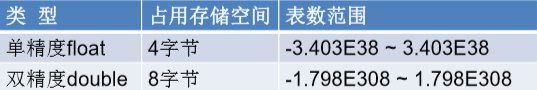
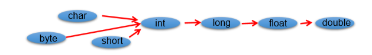
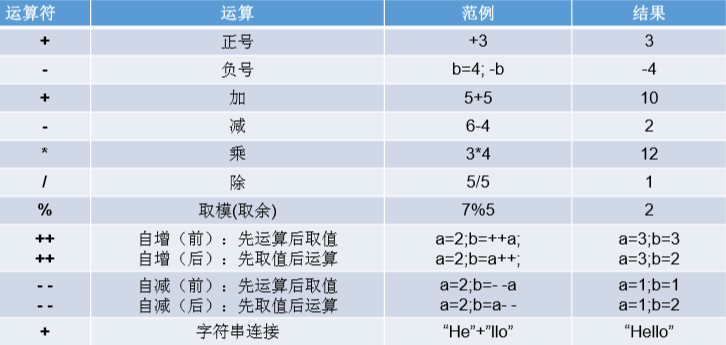
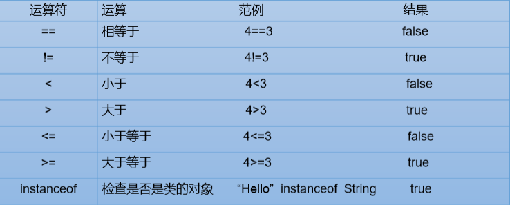
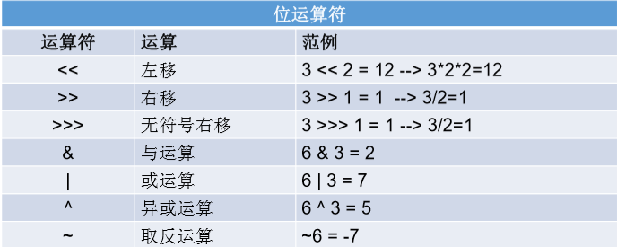
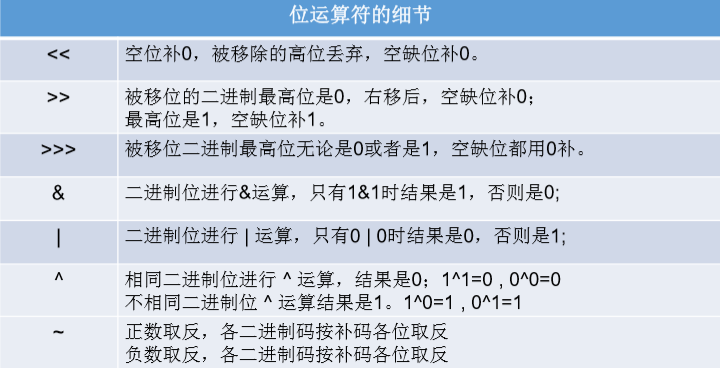
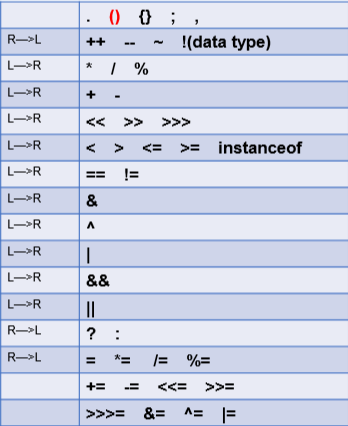

# Java

[TOC]

## 01 Java编程语言概述

### 计算机语言介绍

计算机语言：人与计算机交流的方式。

- **第一代语言：机器语言**

  指令以二进制代码形式存在。

- **第二代语言：汇编语言**

  使用助记符表示一条机器指令。

- **第三代语言：高级语言**

  > C、Pascal、Fortran 面向过程的语言
  >
  > C++ 面向过程/面向对象
  >
  > **Java跨平台的纯面向对象的语言**
  >
  > .NET跨平台语言
  >
  > Python、Scala...

### Java语言概述

- 是**SUN(Stanford University Network，斯坦福大学网络公司) 1995年**推出的一门高级编程语言。
- 是一种面向 Internet 的编程语言。Java 一开始富有吸引力是因为 Java 程序可以在Web浏览器中运行。这些 Java 程序被称为 Java 小程序（applet）。applet 使用现代的图形用户界面与 Web 用户进行交互。 applet内嵌在HTML 代码中。
- 随着 Java 技术在 web 方面的不断成熟，已经成为 Web 应用程序的首选开发语言。

> 1996年，发布JDK 1.0，约8.3万个网页应用 Java 技术来制作。
>
> 2004年，发布里程碑式版本：JDK 1.5，为突出此版本的重要性，更名为JDK 5.0。
>
> 2014年，发布JDK 8.0，是继JDK 5.0以来变化最大的版本。

### Java 技术体系平台

**Java SE(Java Standard Edition)标准版**

支持面向桌面级应用（如 Windows 下的应用程序）的 Java 平台，提供了完整的 Java 核心 API，此版本以前成为 J2SE。

**Java EE(Java Enterprise Edition)企业版**

是为开发企业环境下的应用程序提供的一套解决方案。该技术体系中包含的技术如：Servlet、Jsp 等，主要针对于 Web 应用程序开发。版本以前称为 J2EE。

**Java ME(Java Micro Edition)小型版**

支持 Java 程序运行在移动终端（手机、pad）上的平台，对 Java API 有所精简，并加入了针对移动终端的支持，此版本以前称为 J2ME。

**Java Card**

支持一些 Java 小程序（Applets）运行在小内存设备（如智能卡）上的平台。

### Java 核心机制与 JVM 运行原理

#### Java 语言的特点

- **面向对象**

  两个基本概念：类、对象

  三大特性：封装、继承、多态

- **健壮性**

  吸收了C/C++语言的优点，但去掉了其影响程序健壮性的部分（如指针、内存的申请与释放等），提供了一个相对安全的内存管理和访问机制。

- **跨平台性**

  通过 Java 语言编写的应用程序在不同的系统平台上都可以运行。**"Write once,Run Anywhere"**

  原理：只要在需要运行 Java 应用程序的操作系统上，先安装一个 Java 虚拟机(JVM Java Virtual Machine)即可。由 JVM 来负责 Java 程序在该系统中的运行。

#### Java 语言核心机制

**Java 虚拟机**

- ***JVM 是一个虚拟的计算机，具有指令集并使用不同的存储区域。负责执行指令，管理数据、内存、寄存器。***
- 对于不同的平台，有不同的虚拟机。
- 只有某平台提供了对应的 Java 虚拟机， Java 程序才可在此平台运行。
- Java 虚拟机机制屏蔽了底层运行平台的差别，实现了”一次编译，处处运行“。

**垃圾回收**

- 不再使用的内存空间应回收——垃圾回收。

  在C\C++等语言中，由程序员负责回收无用内存。

  Java 语言消除了程序员回收无用内存空间的责任：它提供一种系统级线程跟踪存储空间的分配情况。并在 JVM 空闲时，检查并释放那些可被释放的存储空间。

- 垃圾回收在 Java 程序运行过程中自动进行，程序员无法精确控制和干预。

- ***Java程序还会出现内存泄漏和内存溢出问题吗？Yes***

### 搭建 Java 开发环境

**JDK(Java Development Kit  Java 开发工具包)** = JRE + 开发工具集（例如 Javac 编译工具等）

**JRE(Java Runtime Environment  Java 运行环境) **  = JVM + JavaSE 标准类库

#### 下载并安装 JDK

- 官方网址

  www.oracle.com

  java.sun.com

- 安装 JDK

  傻瓜式安装，下一步即可。
  建议：安装路径不要有中文或者空格等特殊符号。
  如果操作系统是64位的，软件尽量选择支持64位的（除非软件本身不区分）。
  当提示安装 JRE 时，正常在JDK安装时已经装过了，但是为了后续使用Eclipse等开发 工具不报错，建议也根据提示安装JRE。

#### 配置环境变量

- 我的电脑--属性--高级系统设置--环境变量 

- 新建 JAVA_HOME 系统变量，存放jdk安装路径

- 新建CLASSPATH 系统变量

  **.;%JAVA_HOME%\lib\dt.jar;%JAVA_HOME%\lib\tools.jar;**

- 编辑 path 环境变量，在变量值开始处加上

  **%JAVA_HOME%\bin;%JAVA_HOME%\jre\bin;**

- 打开DOS命令行，任意目录下敲入javac。如果出现javac 的参数信息，配置成功。

### 开发第一个 Java 应用程序

**新建**

新建文本文档，命名为Test

打开输入代码

public class Test(){

​	public static void mian(String[] args){

​		System.out.println("Hello World!");

​	}

}

保存并关闭，修改文件后缀为 .java

运行cmd，进入Test.java所在路径

javac Test.java

.java 源文件通过javac编译成 JVM 可识别的字节码文件，同目录下出现同名.class文件

控制台执行java Test 运行.class文件

显示 Hello World!

### Java 程序的执行原理

将用java语言编写的程序（即源代码.java文件）经过java编译器处理编译成字节码文件（.class文件）

这个字节码文件可在任意一个平台的不同java虚拟机（jvm）上屏蔽平台差异而运行。

在jvm中，程序首先被类装载器处理加载类文件，然后进入字节码校验器检查代码的语法规范性以及安全性，接着进入解释器把抽象的字节码指令映射到本地系统平台下的库引用或指令，最后到操作系统平台运行。

### Java Code Style

自定义类名、接口名与对象名应该是名词与名词短语。遵守驼峰命名规则，所有单词首字母大写。如Customer、WikiPage、Account和AddressParser。避免使用Data或Info这样的类名。不能使动词。比如：Manage、Process。

方法名应当是动词或者动词短语。如postPayment、deletePage或save。

自定义方法名与变量名，首单词小写，后续拼接单词首字母大写。

自定义常量名全部大写，单词间使用下划线连接，如MAX_CLASSES_PER_STUDENT

### 变量的声明和使用

- **变量的概念**

  内存中的一个存储区域，该区域的数据可以在同一类型范围内不断变化。

  变量是程序中最基本的存储单元。包括**变量类型、变量名和存储的值**。

  在方法体外，类体内声明的变量称为成员变量。

  在方法体内声明的变量称为局部变量。

- **变量的作用**

  用于在内存中保存数据

- **使用变量注意事项**

  Java 中每个变量必须先声明，后使用

  使用变量名来访问这块区域的数据

  变量的作用域：其定义所在的一对 {} 内

  变量只有在其作用域内才有效

  同一个作用域内，不能定义重名的变量

- **声明变量**

  语法：<数据类型> <变量名>

  例如：int var;

- **变量的赋值**

  语法：<变量名> = <值>

  例如：var = 10;

- **声明和赋值变量**

  语法：<数据类型> <变量名> = <初始化值>

  例如：int var = 10;

### 变量内存空间分配与原理

1. 寄存器：最快的存储区, 由编译器根据需求进行分配,我们在程序中无法控制.
2. 栈：存放基本类型的变量数据和对象的引用，但对象本身不存放在栈中，而是存放在堆（new 出来的对象）或者常量池中（字符串常量对象存放在常量池中。）
3. 堆：存放所有new出来的对象。
4.  静态域：存放静态成员（static定义的）
5. 常量池：存放字符串常量和基本类型常量（public static final）。
6. 非RAM存储：硬盘等永久存储空间

### 进制与位运算

#### 进制的组成

2进制	0,1 ，满2进1  以0b或0B开头　             如:010101
8进制	0-7 ，满8进1  以数字0开头表示　　    如:012345
10进制  0-9 ，满10进1   　　                              如:100
16进制  0-9及A-F，满16进1. 以0x或0X开头表示   如:0x12c

#### 进制的转换

- **十进制转二进制**
  方法为：十进制数除2取余法，即十进制数除2，余数为权位上的数，得到的商值继续除2，依此步骤继续向下运算直到商为0为止。

- **二进制转十进制**

  方法为：把二进制数按权展开、相加即得十进制数。

- **二进制转八进制**

  方法为：3位二进制数按权展开相加得到1位八进制数。（注意事项，3位二进制转成八进制是从右到左开始转换，不足时补0）。

- **八进制转成二进制**

  方法为：八进制数通过除2取余法，得到二进制数，对每个八进制为3个二进制，不足时在最左边补零。

- **二进制转十六进制**

  方法为：与二进制转八进制方法近似，八进制是取三合一，十六进制是取四合一。（注意事项，4位二进制转成十六进制是从右到左开始转换，不足时补0）

- **十六进制转二进制**

  方法为：十六进制数通过除2取余法，得到二进制数，对每个十六进制为4个二进制，不足时在最左边补零。

### 变量的数据类型

#### 基本数据类型

##### 整数类型

- Java 各整数类型有固定的表数范围和字段长度，不受具体OS的影响，以保证 Java 程序的可移植性。
- Java 的整型常量默认为 int 型，声明 long 型常量须后加 "l" 或 "L" 
- Java 程序中整型变量通常声明为 int 型，除非不足以表示较大的数，才使用 long

##### 浮点类型

- 与整数类型类似，Java 浮点类型也有固定的表数范围和字段长度，不受具体操作 系统的影响。

- 浮点型常量有两种表示形式：

   十进制数形式：如：5.12       512.0f        .512   (必须有小数点） 

  科学计数法形式:如：5.12e2      512E2     100E-2

- float: 单精度，尾数可以精确到7位有效数字。很多情况下，精度很难满足需求。 

  double: 双精度，精度是float的两倍。通常采用此类型。

- Java 的浮点型常量默认为double型，声明float型常量，须后加‘f’或‘F’。 

##### 字符类型

- char 型数据用来表示通常意义上“字符”(2字节) 

- Java 中的所有字符都使用Unicode编码，故一个字符可以存储一个字母，一个汉字，或其他书面语的一个字符。 

- 字符型变量的三种表现形式： 

  1. 字符常量是用单引号(‘ ’)括起来的单个字符。例如：char c1 = 'a';   char c2 = '中'; char c3 =  '9'; 

  2. Java中还允许使用转义字符‘\’来将其后的字符转变为特殊字符型常量。 例如：char c3 = ‘\n’;  // '\n'表示换行符 

  3. 直接使用 Unicode 值来表示字符型常量：‘\uXXXX’。其中，XXXX代表 一个十六进制整数。如：\u000a 表示 \n。 

- char类型是可以进行运算的。因为它都对应有Unicode码。

##### 布尔类型

- boolean 类型用来判断逻辑条件，一般用于程序流程控制： if条件控制语句；
  while循环控制语句；
  do-while循环控制语句；
  for循环控制语句； 

- boolean类型数据只允许取值true和false，无null。 

  不可以使用 0 或非 0 的整数替代false和true，这点和C语言不同。
  Java虚拟机中没有任何供boolean值专用的字节码指令，Java语言表达所操作的 boolean值，在编译之后都使用java虚拟机中的int数据类型来代替：true用1表示，false 用0表示。———《java虚拟机规范 8版》

### 数据类型之间的转换

#### 基本数据类型转换

- 自动类型转换：容量小的类型自动转换为容量大的数据类型。数据类型按容 量大小排序为：

  

- 有多种类型的数据混合运算时，系统首先自动将所有数据转换成容量最大的 那种数据类型，然后再进行计算。

- byte,short,char之间不会相互转换，他们三者在计算时首先转换为int类型。 

- boolean类型不能与其它数据类型运算。 

- 当把任何基本数据类型的值和字符串(String)进行连接运算时(+)，基本数据类 型的值将自动转化为字符串(String)类型。

#### 强制类型转换

- 自动类型转换的逆过程，将容量大的数据类型转换为容量小的数据类型。使 用时要加上强制转换符：()，但可能造成精度降低或溢出,格外要注意。

- 通常，字符串不能直接转换为基本类型，但通过基本类型对应的包装类则可以实现把字符串转换成基本类型。

  如： String a = “43”; int i = Integer.parseInt(a);

### 变量的运算与底层运算原理

#### 运算符

##### 算术运算符

##### 赋值运算符

= ， += ， -= ，  *= ，  /= ，  %=

##### 关系运算符

##### 逻辑运算符

&  逻辑与			|  逻辑或		 ！  逻辑非		

&&  短路与		||  短路或		^   逻辑异或

##### 位运算符

##### 三元运算符

**格式：**

(条件表达式)?表达式1：表达式2；

1. 表达式1和表达式2为同种类型
2. 条件表达式为true，运算后的结果是表达式1；
3. 条件表达式为false，运算后的结果是表达式2；

#### 运算符的优先级

- 运算符有不同的优先级，所谓 优先级 就是表达式运算中的运 算顺序。如下表，上一行运算符总优先于下一行。
- 只有单目运算符、三元运算符、 赋值运算符是从右向左运算的。

## 02 Java 基础语法

### 流程控制语句的介绍

- 流程控制语句是用来控制程序中各语句执行顺序的语句，可以把语句组合成能完成一定功能的小逻辑模块。

- 其流程控制方式采用结构化程序设计中规定的三种基本流程结构，即：

  **顺序结构：**程序从上到下逐行地执行，中间没有任何判断和跳转。

  **分支结构：**根据条件，选择性地执行某段代码。如(if...else / switch-case)

  **循环结构：**根据循环条件，重复性的执行某段代码。如(while / do...while / for / foreach)

### Java 编译器执行流程

### if 分支结构

-  条件表达式必须是布尔表达式、布尔变量
- 语句块只有一条执行语句时，一对 {} 可以省略，但建议保留
- if-else 语句结构，根据需要可以嵌套使用
- 当 if-else 结构是“多选一”时，最后的 else 是可选的，根据需要可以省略
- 当多个条件是“互斥”关系时，条件判断语句及执行语句间顺序无所谓；当多个条件是“包含”关系时，“小上大下 / 子上父下”

### switch 选择结构与相关规则

- switch(表达式)中表达式的值**必须**是以下几种类型之一： byte ， short ， char ， int ， 枚举( jdk 5.0)， String( jdk 7.0);
- case 子句中的值必须是**常量**，不能是变量名或不确定的表达式值；
- 同一个 switch 语句，所有 case 子句中的常量值互不相同；
- break 语句用来在执行完一个 case 分支后使程序跳出 switch 语句块；如果没有 break ，程序回顺序执行到 switch 结尾
- default 子句是可任选的。同时，位置也是灵活的。当没有匹配的 case 时，执行 default

#### switch 和 if 语句的对比

1. 如果判断的具体数值不多，而且符合 byte 、 short 、 char 、 int 、 String 、 枚举等几种类型。虽然两个语句都可以使用，建议使用 switch 语句。因为效率稍高。
2. 其他情况：对区间判断，对结果为 boolean 类型判断，使用 if ， if 的使用范围更广。也就是说，使用 switch-case 的，都可以改写为 if-else 。反之不成立。

### 循环结构x

在某些条件满足的情况下，反复执行特定代码的功能

### for 循环

- **语法格式**

  for(①初始化部分；②循环条件部分；④迭代部分){

  ​	③循环体部分；

  }

- **执行过程**

  ① - ② - ③ - ④ - ② - ③ - ④ - ② - ③ - ④ - ... - ②

- **说明**

  ② 循环条件部分为 boolean 类型表达式，当值为 false 时，退出循环

  ① 初始化部分可以声明多个变量，但必须是同一个类型，用逗号分隔

  ④ 可以有多个变量更新，用逗号分隔

### while 循环

- **语法格式**

  ①初始化部分 

  while(②循环条件部分)｛ 

  ​		③循环体部分; 

  ​		④迭代部分; 

  }

- **执行过程**

  ① - ② - ③ - ④ - ② - ③ - ④ - ② - ③ - ④ - ... - ②

- **说明**

  注意不要忘记声明④迭代部分。否则，循环将不能结束，变成死循环。 

  for循环和while循环可以相互转换

### do-while 循环

- **语法格式**

  ①初始化部分; 

  do{ 

  ​		③循环体部分 

  ​		④迭代部分 

  }while(②循环条件部分);

- **执行过程**

  ① - **③ - ④** - ② - ③ - ④ - ② - ③ - ④-  ... ②

- **说明**

  do-while循环至少执行一次循环体

### 特殊流程控制语句

- **break** 

  **终止本层循环**

  出现在多层嵌套的语句块中时，可以通过标签指明要终止的是 哪一层语句块 

  break 只能用于switch语句和循环语句中

  之后不能有其他的语句，因为程序永远不会执行其后的语句。 

- **continue**

  continue 只能用于循环语句中

  **终止本次循环**，继续下一次循环

  出现在多层嵌套的循环语句体中时，可以通过标签指明要跳过的是哪一层循环

  之后不能有其他的语句，因为程序永远不会执行其后的语句。 

- **return**

  并非专门用于结束循环，他的功能是结束一个方法。当一个方法执行到一个 return 语句时，这个方法将被结束

  与break和continue不同的是，return直接结束整个方法，不管这个return处于多少层循环之内

### 方法的声明与使用

### 方法调用的过程分析

### 跨类调用方法

### 参数的值传递

### 方法的重载 Overload

## 03 Java 数组

### static 修饰符

### 类的成员之代码块

### 静态代码块与非静态代码块

### 单例 (Singleton) 设计模式

### final 修饰符

### 包 (package) 的管理与作用

### DOS 命令行下编译器操作

### 使用 jar 命令打包应用程序

### 数组的创建与使用

#### 数组的概述

- 数组 (Array)，是多个相同类型数据按一定顺序排列的集合，并使用一个名字命名，并通过编号的方式对这些数据进行统一管理。

- 数组本身是引用数据类型，而数组中的元素可以是任何数据类型，包括基本数据类型和引用数据类型。
- 创建数组对象会在内存中开辟一整块连续的空间，而数组名中引用的是这块连续空间的首地址。 
- 数组的长度一旦确定，就不能修改。 
- 我们可以直接通过下标(或索引)的方式调用指定位置的元素，速度很快。 

#### 数组的使用

- 定义并用运算符new为之分配空间后，才可以引用数组中的每个元素；

- 数组元素的引用方式：数组名[数组元素下标]

  数组元素下标可以是整型常量或整型表达式。如a[3] , b[i] , c[6*i];

  数组元素下标**从0开始**；长度为n的数组合法下标取值范围: 0 —>n-1；如int a[]=new int[3];  可引用的数组元素为a[0]、a[1]、a[2]

- 每个数组都有一个属性length指明它的长度，例如：a.length 指明数组a的长 度(元素个数)

  数组一旦初始化，其长度是不可变的

- 数组是引用类型，它的元素相当于类的成员变量，因此数组一经 分配空间，其中的每个元素也被按照成员变量同样的方式被隐式初始化。

  对于基本数据类型而言，默认初始化值各有不同 

  对于引用数据类型而言，默认初始化值为null(注意与0不同！)

### 一维数组与多维数组

- **动态初始化：**数组声明且为数组元素分配空间与赋值的操作分开进行
- **静态初始化：**在定义数组的同时就为数组元素分配空间并赋值。

**注意特殊写法情况：int[] x,y[]; x是一维数组，y是二维数组。**

 **Java中多维数组不必都是规则矩阵形式**

### 数组的常见算法分析

1. 数组元素的赋值(杨辉三角、回形数等)
2. 求数值型数组中元素的最大值、最小值、平均数、总和等
3. 数组的复制、反转、查找(线性查找、二分法查找)
4. 数组元素的排序算法

**二分法查找**

- 要求此数组必须是有序的
- 从中间索引与需要查找的元素对比，比元素小就增加索引，比元素大就减小索引

**排序算法**

假设含有n个记录的序列为 {R1，R2， ...，Rn}，其对应的关键字序列为 {K1，K2，...，Kn}。将这些记录重新排序为{Ri1，Ri2，...，Rin}，使得相应的关键字值满足条 Ki1 <= Ki2 <= ... <= Kin，这样的一种操作称为排序。

通常来说，排序的目的是快速查找。

**排序算法的优劣**

1. 时间复杂度：分析关键字的比较次数和记录的移动次数
2. 空间复杂度：分析排序算法中需要多少辅助内存
3. 稳定性：若两个记录 A和B 的关键字值相等，但排序后 A、B的先后次序保持不变，则称这种排序算法是稳定的。

**内部排序：**整个排序过程不需要借助于外部存储器（如磁盘等），所有排序操作都在内存中完成。

- 选择排序

  直接选择排序、堆排序

- 交换排序

  冒泡排序、快速排序

- 插入排序

  直接插入排序、折半插入排序、Shell排序

- 归并排序

- 桶式排序

- 基数排序

**外部排序：**：参与排序的数据非常多，数据量非常大，计算机无法把整个排
序过程放在内存中完成，必须借助于外部存储器（如磁盘）。外部排序最
常见的是多路归并排序。可以认为外部排序是由多次内部排序组成。

#### 数组中常见算法

**冒泡排序**

**介绍：**冒泡排序的原理非常简单，它重复地走访过要排序的数列，一次比较两个元 素，如果他们的顺序错误就把他们交换过来。

**排序思想：**

1. 比较相邻的元素。如果第一个比第二个大（升序），就交换他们两个。 
2. 对每一对相邻元素作同样的工作，从开始第一对到结尾的最后一对。这步 做完后，最后的元素会是最大的数。
3. 针对所有的元素重复以上的步骤，除了最后一个。 
4. 持续每次对越来越少的元素重复上面的步骤，直到没有任何一对数字需要 比较为止。

**快速排序：**

**介绍：**快速排序通常明显比同为O(nlogn)的其他算法更快，因此常被采用，而且快排采用了分治法的思想，快速排序（Quick Sort）由图灵奖获得者Tony Hoare发明，被列为20世纪十大算法之一，是迄今为止所有内排序算法中速度最快的一种。冒泡排序的升级版，交换排序的一种。快速排序的时间复杂度为O(nlog(n))。

**排序思想：**先挑一个数和数组最后和最前的数比较，大的放后面，小的放前面，最后这个数会在中间。在前后各挑一个数，继续这种操作。

1. 从数列中挑出一个元素，称为"基准"（pivot），
2. 重新排序数列，所有元素比基准值小的摆放在基准前面，所有元素比基准 值大的摆在基准的后面（相同的数可以到任一边）。在这个分区结束之后， 该基准就处于数列的中间位置。这个称为分区（partition）操作。 
3. 递归地（recursive）把小于基准值元素的子数列和大于基准值元素的子数 列排序。 
4.  递归的最底部情形，是数列的大小是零或一，也就是永远都已经被排序好 了。虽然一直递归下去，但是这个算法总会结束，因为在每次的迭代 （iteration）中，它至少会把一个元素摆到它最后的位置去。

**性能比较**

1. 从平均时间而言：快速排序最佳。但在最坏情况下时间性能不如堆排序和归并排序
2. 从算法简单性看：由于直接选择排序、直接插入排序和冒泡排序的算法比较 简单，将其认为是简单算法。对于Shell排序、堆排序、快速排序和归并排序 算法，其算法比较复杂，认为是复杂排序。
3. 从稳定性看：直接插入排序、冒泡排序和归并排序时稳定的；而直接选择排序、快速排序、 Shell排序和堆排序是不稳定排序 
4. 从待排序的记录数n的大小看，n较小时，宜采用简单排序；而n较大时宜采用改进排序。

**排序算法的选择**

1. 若n较小(如n≤50)，可采用直接插入或直接选择排序。
   当记录规模较小时，直接插入排序较好；否则因为直接选择移动的记录数少于直
   接插入，应选直接选择排序为宜。
2. 若文件初始状态基本有序(指正序)，则应选用直接插入、冒泡或随机的快速排
   序为宜； 
3. 若n较大，则应采用时间复杂度为O(nlgn)的排序方法：快速排序、堆排序或
   归并排序。

### 操作数组的工具类 Arrays

java.util.Arrays类即为操作数组的工具类，包含了用来操作数组（比 如排序和搜索）的各种方法。

### 命令行参数

### 可变参数

## 04 面向对象编程

### 面向对象和面向过程的理解

- **面向过程**（POP  Procedure Oriented Programming）**与 面向对象**（OOP  Object Oriented Programming）

  二者都是一种思想，面向对象是相对于面向过程而言的。面向过程，**强调是功能行为，以函数为最小单位**，考虑怎么做。面向对象，将功能封装进对象，**强调具备了功能的对象，以类/对象为最小单位**，考虑谁来做。

  面向对象更加强调运用人类在日常的思维逻辑中采用的思想方法与原则，如抽象、分类、继承、聚合、多态等。

- **面向对象三大特征**

  封装（Encapsulation）

  继承（Inheritance）

  多态（Polymorphism）

### 类和对象的理解

### 类和对象的创建、使用

### 属性

### 方法

### 包

### this

### 构造器

### 封装

### JavaBean

### 继承

### super 关键字

### 重写

### 多态

### Object 类

